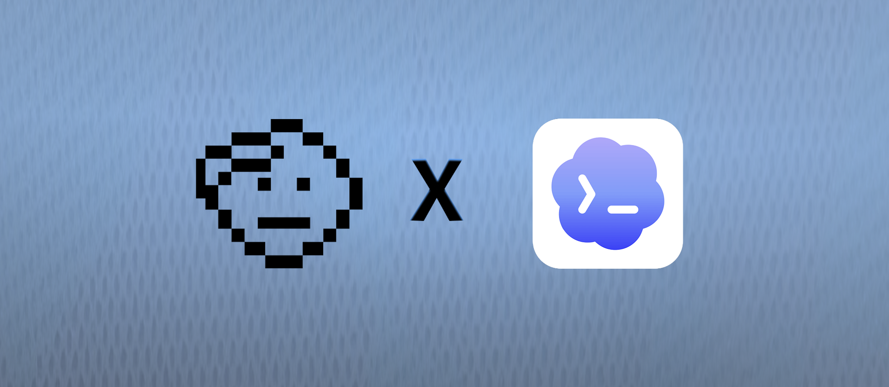

# codex-honcho

[](https://honcho.dev)

[](https://opensource.org/licenses/MIT)
[](https://www.npmjs.com/package/@honcho-ai/codex-honcho)
[](https://honcho.dev)

**Persistent memory for [OpenAI Codex](https://developers.openai.com/codex), powered by [Honcho](https://honcho.dev) from Plastic Labs.**

Give Codex long-term memory that survives context resets, session restarts, and fresh conversations. Codex remembers what you're working on, your preferences, and the decisions you've made — across every project. Lifecycle hooks capture each session to Honcho and inject the relevant context back at session start, so you never have to repeat yourself.

## What You Get

- **Persistent Memory** — Codex remembers your preferences, projects, and context across sessions
- **Survives Context Resets** — Memory persists through `/clear`, compaction, and restarts
- **Active Recall** — Codex can search your history and query what Honcho knows about you mid-task, not just at startup
- **Git Awareness** — Optionally scope memory per branch, so feature work keeps its own context
- **Flexible Sessions** — Map memory per directory, per repository, per git branch, or per chat instance
- **Per-Repo Isolation** — Route a repository to its own Honcho workspace with a checked-in `.honcho/config.json`
- **Local-First Capture** — Conversations are queued to disk instantly and uploaded in the background — capture never blocks your turn or hits the network mid-conversation
- **Cross-Tool Context** — Shares `~/.honcho/config.json` with other Honcho integrations (Claude Code, Cursor, …), so context can follow you between tools

## Prerequisites

- **[Codex](https://developers.openai.com/codex) ≥ 0.136.0**
- **[Node](https://nodejs.org)** on your `PATH` (runs the installer and the hooks)

## Quick Start

### Step 1: Get Your Honcho API Key

1. Go to **[app.honcho.dev](https://app.honcho.dev)**
2. Sign up or log in
3. Copy your API key (starts with `hch-`)

### Step 2: Save Your API Key

Your key lives in **`~/.honcho/config.json`** — the single config file every Honcho integration reads. codex-honcho takes the key straight from there.

**Already have your key in `~/.honcho/config.json`?** If another Honcho integration already wrote it there, there's nothing to do — skip to Step 3 and `install` picks it up automatically. (codex-honcho reads only this file, `hosts.codex`, and `HONCHO_API_KEY` — not any tool's private config, so confirm the key is in `~/.honcho/config.json` with `codex-honcho status`.)

**First time?** Create it with the Honcho CLI:

```bash
honcho init   # prompts for your key, writes ~/.honcho/config.json
              # no CLI yet? uv tool install honcho-cli && honcho init
```

Either way the key stays in one place. If you'd rather write the file yourself:

```jsonc
// ~/.honcho/config.json
{ "apiKey": "hch-your-api-key-here" }
```

### Step 3: Install the Plugin

```bash
npm install -g @honcho-ai/codex-honcho
codex-honcho install      # registers hooks + MCP + skill in ~/.codex
```

`install` registers a local MCP server in `~/.codex/config.toml`. The server reads the active Honcho config at runtime, so API keys never appear in Codex's config and repo-local workspace/endpoint overrides apply to MCP tools as well as hooks. Restart Codex after rotating a key or changing configuration.

### Step 4: Restart Codex

Restart Codex (or start a new session) to load the hooks and the `[features].hooks` flag. On your next session start you'll see Honcho memory load into context.

### Step 5: (Optional) Tell Codex to use its memory

The bundled `honcho-memory` skill already nudges Codex to recall and save actively. To reinforce it, add a short directive to your global Codex instructions (`~/.codex/AGENTS.md`):

```markdown
# Honcho Memory

You have persistent memory via Honcho. Context about me is loaded at the start
of every session — trust it and act on it; don't ask me what you already know.
Use the Honcho MCP tools (`search`, `chat`) to recall more mid-task, and
`create_conclusions` to save new preferences, decisions, and patterns as you learn them.
```

## MCP Tools

Once installed, Codex can call these Honcho tools through the local MCP server:

| Tool                  | Description                                          |
| --------------------- | --------------------------------------------------- |
| `search`              | Semantic search across your session messages        |
| `chat`                | Ask Honcho a natural-language question about you     |
| `get_peer_context`    | Fetch the current model of you (representation + peer card) |
| `get_representation`  | Lightweight representation string                   |
| `create_conclusions`  | Save durable insights to memory                      |
| `list_conclusions`    | List saved conclusions                              |
| `query_conclusions`   | Semantic search across derived conclusions          |
| `delete_conclusion`   | Remove a conclusion by ID                           |

## Commands

| Command                  | Effect                                            |
| ------------------------ | ------------------------------------------------- |
| `codex-honcho install`   | Install hooks + MCP + skill                        |
| `codex-honcho status`    | Installed components, pending queue depth, GUI link |
| `codex-honcho remove`    | Strip only what this installs                       |

## Configuration

Global defaults live in `~/.honcho/config.json` (shared with other Honcho integrations). Codex-specific settings go under `hosts.codex`, falling back to the root fields. Hooks and the MCP server only read configuration at runtime; `install` is the only writer, and it writes only resolved global credentials/identity back to the shared file.

```jsonc
{
  "apiKey": "hch-…",
  "peerName": "alice",              // your identity (default: $USER)
  "hosts": {
    "codex": {
      "workspace": "codex",          // Honcho workspace for Codex memory
      "sessionStrategy": "per-directory",
      "injectPerPrompt": false,      // re-inject context every turn (off by default)
      "saveMessages": true           // false = read memory but never write
    }
  }
}
```

### Repo-Local Configuration

Place `.honcho/config.json` in a repository to override selected global values for that project. The nearest file at or above Codex's working directory wins, so one file at the repository root covers the whole tree and a nested file can carve out a more specific scope.

The local file is an overlay, not a replacement. This is usually all a repository needs:

```jsonc
// <repo>/.honcho/config.json
{
  "workspace": "my-project"
}
```

`apiKey`, `peerName`, `endpoint`, and any other omitted values continue to come from `~/.honcho/config.json`. The same host-aware shape works too:

```jsonc
{
  "hosts": {
    "codex": {
      "workspace": "my-project",
      "sessionStrategy": "per-repo"
    }
  }
}
```

Repo-local configuration is read-only to codex-honcho: the plugin never writes it or copies its values into the global file. Keep secrets out of repositories; a committed local config should normally contain only non-secret routing/session settings. A self-contained local config with its own `apiKey` is supported when no global config exists, but the file should then remain untracked and appropriately protected.

With a local config active, session identity anchors to the directory containing `.honcho/` instead of whichever subfolder Codex is currently using. Optional local-only fields provide more control:

```jsonc
{
  "workspace": "my-project",
  "sessionName": "shared-project-memory", // pin one exact session name
  "splitSubmodules": true                 // split nested git repos under other strategies
}
```

The local MCP server is launched in Codex's active working directory, resolves the same nearest config, and calls Honcho through the SDK with the resolved endpoint, workspace, and identity. Restart Codex after adding or changing `.honcho/config.json` so its MCP process reconnects with the new values.

### Session Strategies

Controls how Codex conversations map to Honcho sessions:

| Strategy | Session name | Best for |
| --- | --- | --- |
| `per-directory` (default) | `my-app` | Most users — each project accumulates its own memory |
| `per-repo` | `my-app` | One memory session for every directory in the same Git repository |
| `git-branch` | `my-app-main` | Feature-branch workflows where context per branch matters |
| `chat-instance` | `my-app-019ea7df` | Ephemeral usage — a clean slate per conversation |

`per-repo` matches the Hermes Honcho provider: it uses the Git root directory name, so launching Codex from `src/`, `packages/app/`, or the repository root resolves to the same session. Outside a Git repository it falls back to `per-directory`. A nested repository or worktree with its own `.git` file/directory gets its own session; with repo-local configuration, discovery stays inside that configuration's project root.

On the global-only path, an explicit `sessions[cwd]` mapping overrides all strategies. Repo-local configuration instead anchors sessions to its project root as described above. Environment overrides: `HONCHO_API_KEY`, `HONCHO_PEER_NAME`, `HONCHO_CONFIG_DIR`.

## How It Works

```
┌──────────────────────────────────────────────────────────────────────┐
│                              Codex                                    │
├──────────────────────────────────────────────────────────────────────┤
│  SessionStart  │  UserPrompt     │  PostToolUse   │  Stop / PreCompact │
│  ───────────   │  ───────────    │  ────────────  │  ───────────────── │
│  recall:       │  prompt:        │  observe:      │  writeback:        │
│  load context  │  (optional)     │  note tool     │  capture the new   │
│  from Honcho   │  per-turn ctx   │  calls         │  transcript tail   │
└──────────────────────────────────────────────────────────────────────┘
                              │
                              ▼
          ~/.honcho/codex/queue/<key>.jsonl   (append-only, local, instant)
                              │
                              ▼  flush (inline, end of turn)
                         Honcho API  →  Persistent Memory
                              │
                              ▼  retrieved as context at the next session start
```

The plugin hooks into Codex's lifecycle events:

- **SessionStart** (`recall`) — creates/materializes the session and injects a lean `<honcho-memory>` context block
- **UserPromptSubmit** (`prompt`) — optional per-turn context injection (off by default; the MCP tools cover depth)
- **PostToolUse** (`observe`) — appends a one-line note for significant tool calls to the local queue
- **Stop / PreCompact** (`writeback`) — captures the new transcript tail, then flushes the queue to Honcho

Capture is **local-first**: hooks only ever append to a plain JSONL queue, so they're instant and never touch the network. The flush is lock-guarded and advances a per-chunk sent marker, so a failed or partial upload simply stays queued and retries on the next turn. Inspect the local queue any time with `tail -f ~/.honcho/codex/queue/*.jsonl`, and run `codex-honcho status` to see the pending depth plus a deep link to your session in the Honcho GUI to confirm what landed server-side.

When repo-local configuration is active, local queue/cache keys include its resolved workspace. Turning on an override therefore cannot flush previously queued global-session messages into the project workspace.

## Troubleshooting

**No memory loading / MCP not registered.** Confirm your key is in `~/.honcho/config.json` (`codex-honcho status` shows `honcho config: found`). If it's missing, run `honcho init` (or add `{ "apiKey": "hch-…" }` to the file yourself), then re-run `codex-honcho install` — without a key, install registers the hooks and skill but skips the MCP server.

**Hooks aren't firing.** Restart Codex after installing so it loads `hooks.json` and the `[features].hooks` flag. Check `codex-honcho status` for installed components and pending queue depth.

**Memory not persisting.** Make sure `saveMessages` isn't set to `false` under `hosts.codex`.

**Repo-local config not taking effect.** Run `codex-honcho status` from the repository; it prints the active local config path when one is found. Restart Codex after changing the file so the MCP server reconnects with the same resolved workspace used by hooks.

## What Install Writes

| Path | Change |
|---|---|
| `~/.codex/honcho/` | staged copy of the bundle the hooks run (kept stable across npm/npx cache eviction) |
| `~/.codex/hooks.json` | adds the four hook entries (merged; your own hooks untouched) |
| `~/.codex/config.toml` | sets `[features].hooks = true`; registers `[mcp_servers.honcho]` as a credential-free local stdio server |
| `~/.codex/skills/honcho-memory/` | the active-recall skill |
| `~/.honcho/config.json` | persists the resolved `apiKey` + `peerName` (other fields and `hosts.*` blocks preserved) |

`codex-honcho remove` reverses exactly these.

## Install from a GitHub Clone (no npm)

```bash
git clone https://github.com/plastic-labs/codex-honcho
cd codex-honcho
./install.sh              # bun install + bun run bin/codex-honcho.ts install
```

The clone path runs the TypeScript source directly and so requires **[bun](https://bun.sh)**; it wires the hooks to `bun run <this dir>/bin/codex-honcho.ts`, so keep the clone in place. The npm install instead stages the bundled `dist/codex-honcho.mjs` to `~/.codex/honcho/` and wires hooks to `node` — node-only, and stable across `npm update`, npx cache eviction, or removing the package.

## Development

```
bin/codex-honcho.ts      CLI: install · remove · status · <hook verb>
src/dispatch.ts          verb → handler routing
src/hooks/               recall · prompt · observe · writeback · flush
src/transcript/codex.ts  Codex rollout (.jsonl) parser
src/queue.ts             append-only outbox + sent high-water-mark
src/cursor.ts            per-conversation rollout delta cursor
src/connectors/          hooks.json · config.toml MCP block · skill writers
src/config.ts            global + repo-local resolution; session naming
src/mcp.ts               cwd-aware local MCP server backed by the Honcho SDK
skills/honcho-memory/    when-to-recall guidance for the model
```

```bash
bun test
bun run typecheck
```

## License

MIT — see [LICENSE](LICENSE)

## Links

- **Honcho**: [honcho.dev](https://honcho.dev) — the memory API
- **Documentation**: [docs.honcho.dev](https://docs.honcho.dev)
- **Discord**: [Join the community](https://discord.gg/plasticlabs)
- **X**: [@honchodotdev](https://x.com/honchodotdev)
- **Plastic Labs**: [plasticlabs.ai](https://plasticlabs.ai)
